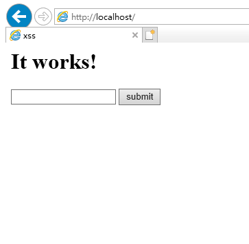
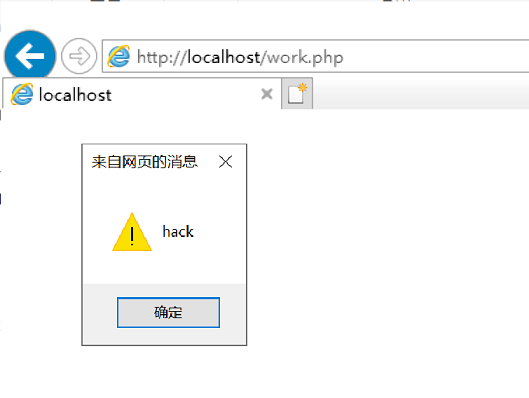

# XSS攻击
## XSS
* XSS攻击通常指的是通过利用网页开发时留下的漏洞，通过巧妙的方法注入恶意指令代码到网页，使用户加载并执行攻击者恶意制造的网页程序。这些恶意网页程序通常是JavaScript，但实际上也可以包括Java、 VBScript、ActiveX、 Flash 或者甚至是普通的HTML。攻击成功后，攻击者可能得到包括但不限于更高的权限（如执行一些操作）、私密网页内容、会话和cookie等各种内容。  
* HTML是一种超文本标记语言，通过将一些字符特殊地对待来区别文本和标记，例如，小于符号（<）被看作是HTML标签的开始，<title>与</title>之间的字符是页面的标题等等。当动态页面中插入的内容含有这些特殊字符（如<）时，用户浏览器会将其误认为是插入了HTML标签，当这些HTML标签引入了一段JavaScript脚本时，这些脚本程序就将会在用户浏览器中执行。所以，当这些特殊字符不能被动态页面检查或检查出现失误时，就将会产生XSS漏洞。
## 实验环境  
* [安装Apache](https://blog.csdn.net/Ag_wenbi/article/details/90609947)  
* [安装php](https://blog.csdn.net/dyq1995/article/details/89429335)  
## 实验准备
* 改写apache的默认网页文件 index.html ：  
```bash
<html><body><h1>It works!</h1></body></html>
<!doctype html>
<html lang="en">
    <head>
        <title>xss</title>
        <meta charset="UTF-8">
    </head>
    <body>
        <form action="./work.php" method="post">
            <input type="text" name="name" />
            <input type="submit" value="submit">
        </form>
    </body>
</html>
```
* 在该目录下新建php文件 work.php :  
```bash
<?php
    $name=$_POST['name'];
    echo $name;
?>
```
## 实验操作
* 在IE浏览器输入本地IP或者 localhost，即可跳转至如下页面：  
  
* 向其中填入```<script>alert('hack')</script>```后点击submit：  
  
* 前端顺利弹框，说明攻击成功。  