# 缓冲区溢出
## 函数调用
* 函数调用时，首先进行参数传递，有几个参数就进行几次push，这个过程叫参数压栈。其中esp是栈顶指针，ebp为栈底指针，由于压栈的顺序是反的，即是从最后一个参数开始压入栈的，所以最后栈中离ebp最近的是第一个参数。
* 参数如数入栈之后执行call指令，以将它的下一条指令的指令存入栈中，作为返回地址。call指令存在，证明存在函数调用，此时将跳转到被调用函数处进行继续执行，在被调用的函数执行完之后，之前存入栈中的地址将指明此时的程序应该去向何方。（返回主调处继续执行）  
* 由函数代码的反汇编可以发现其中的共同之处（以下图为例），这些步骤即是在进行栈的构造。  
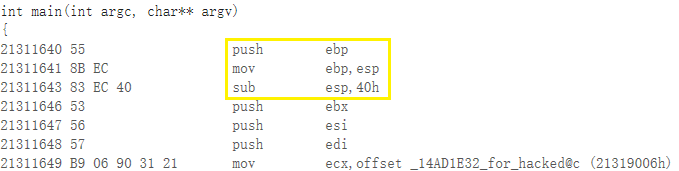  
将当前的ebp（栈底指针）入栈，保存当前函数（主调函数）的基址；再将当前的栈顶指针值作为栈底指针值存入ebp中，即新的栈结构（被调函数的栈结构）的栈底；再将栈顶指针esp值增大，即栈顶指针上移，为局部变量等开辟空间。  
* 通过上述过程，可以发现，在这种栈结构的不断生成中，可以保证各个函数之间的独立性，各自拥有自己的栈，正常情况下数据不会相互干扰，且生成的栈会在被调用的函数执行完之后进行退栈，将回到主调函数处继续执行。
## 缓冲区溢出
缓冲区溢出是指当计算机向缓冲区内填充数据位数时超过了缓冲区本身的容量，溢出的数据覆盖在合法数据上。通过往程序的缓冲区写超出其长度的内容，造成缓冲区的溢出，从而破坏程序的堆栈，使程序转而执行其它指令，以达到攻击的目的。造成缓冲区溢出的原因是程序中没有仔细检查用户输入的参数。
## 实验准备 PART1
* 对项目属性进行修改，修改后结果如下：  
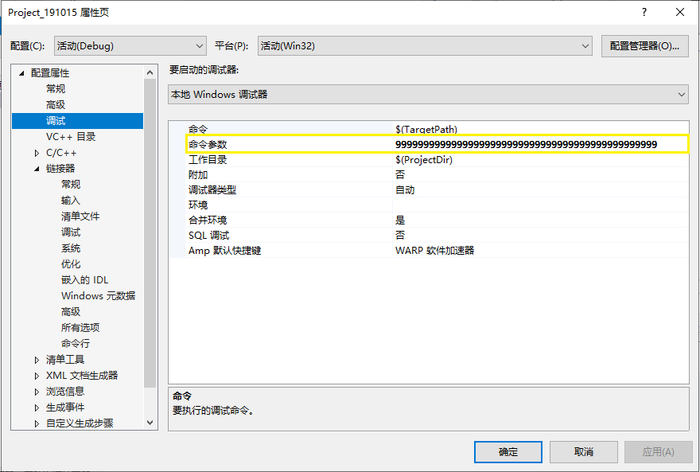
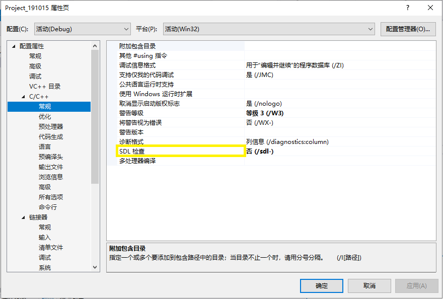  
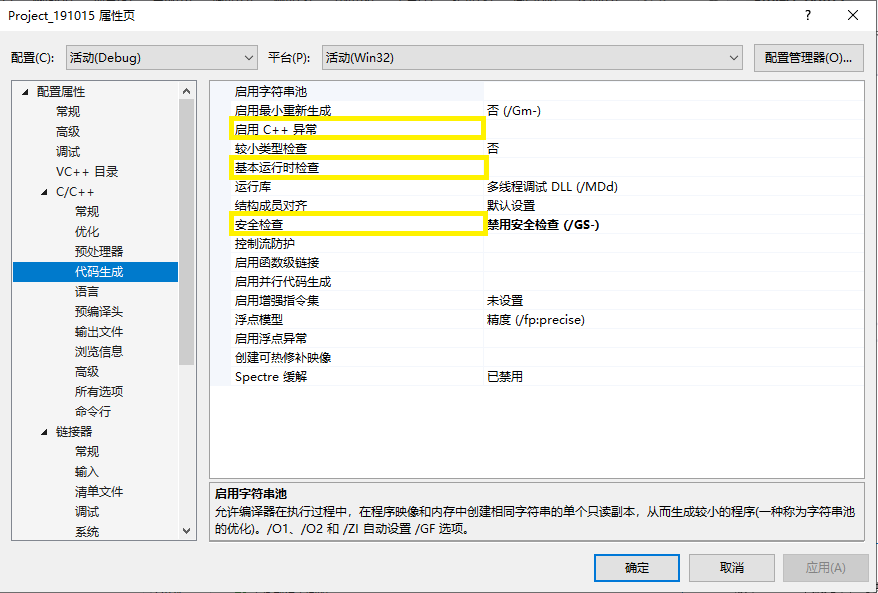  
* 实验代码：  
```bash
#define _CRT_SECURE_NO_WARNINGS

#include <stdlib.h>
#include <stdio.h>
#include <string.h>

int sub(char* x)
{
	char y[10];
	strcpy(y, x);
	return 0;
}

int main(int argc, char** argv)
{
	if (argc > 1)
		sub(argv[1]);
	printf("exit");
}
```
## 实验过程 PART1  
* 由代码可知，设定的值为sub函数中的值，sub中的strcpy(y,x)即完成了将x的值传给y，然而在定义y时，y的长度只有10，因此可以预见将出现溢出情况。  
* 在完成x值的传入后（仅mov），可以看到：  
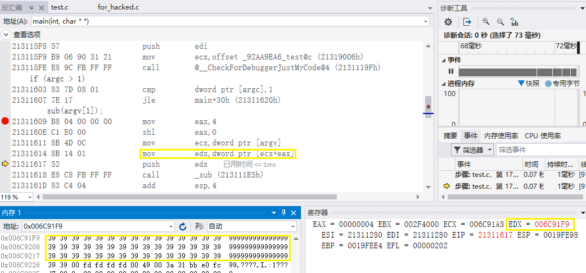  
edx中存放的即为先前人为指定的值。  
* push之后：  
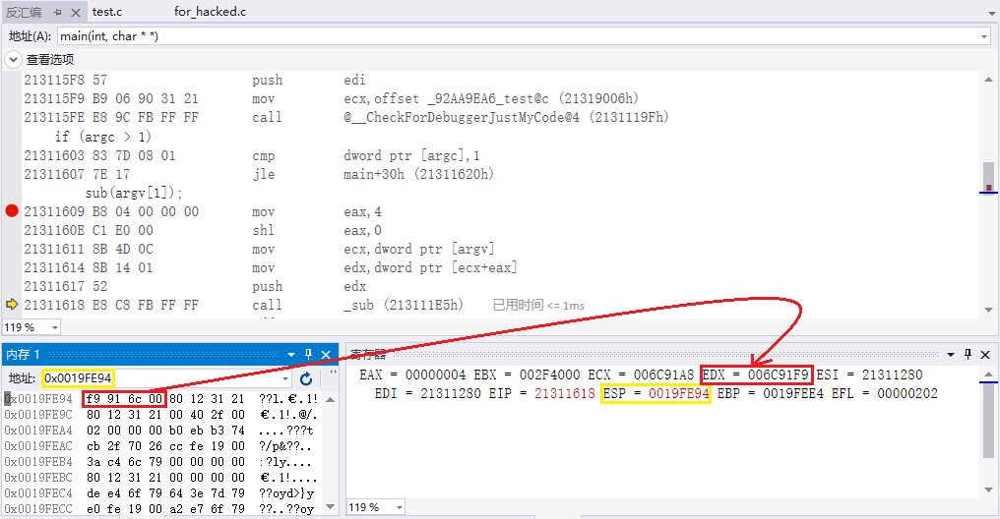  
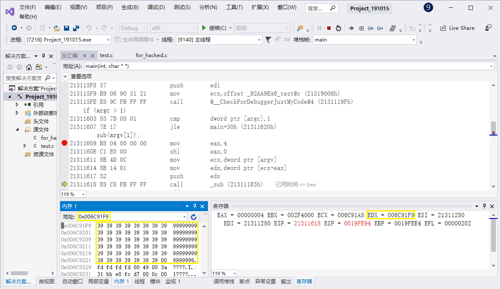  
esp中存放了当前edx寄存器的值，edx中存放999999...  
* 继续执行，在sub函数中也是同样的过程，先将当前的ebp入栈，将当前的esp存为ebp，进行call指令，逻辑上跳往下一个被调函数，结构上前往一个新建的栈。  
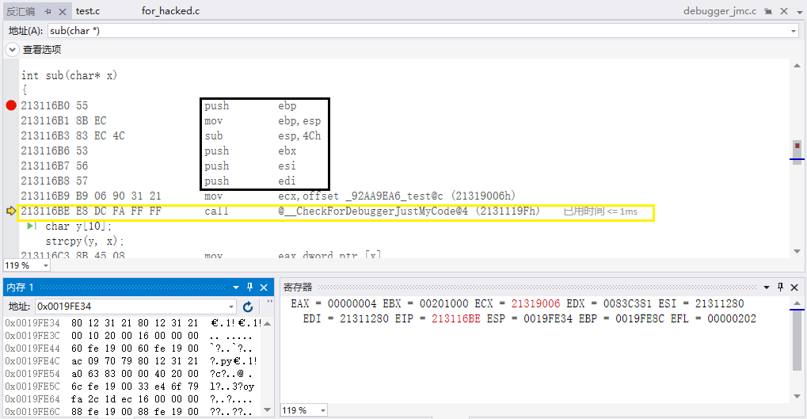  
从图中可以看出参数反序入栈这一点。  

## 实验准备 PART2（PART1沿用）
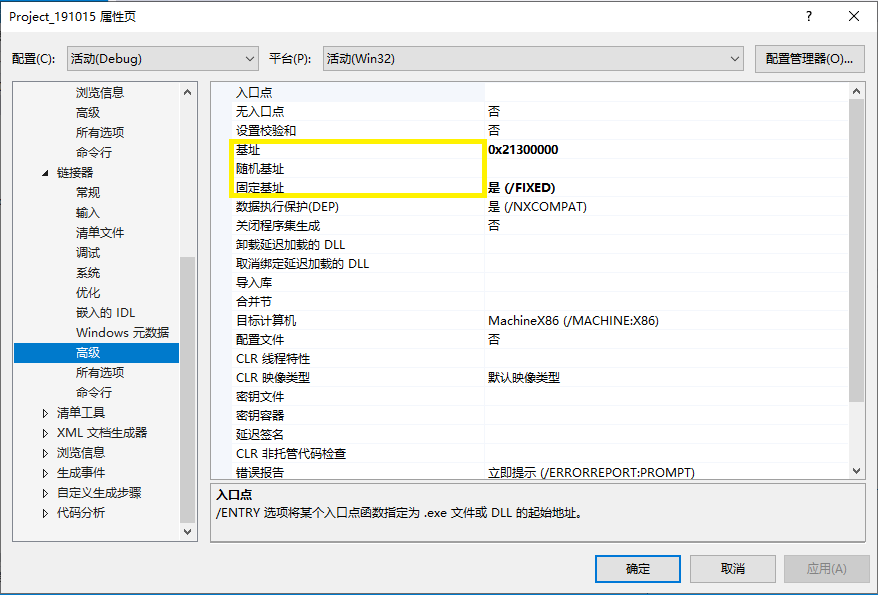  
*固定了基址便于确定hacked函数的位置和跳转的实现。*  
* 实验代码：  
```bash
#define _CRT_SECURE_NO_WARNINGS

#include <stdlib.h>
#include <stdio.h>
#include <string.h>
int hacked()
{
	printf("hacked!!");
    return 0;
}

int sub(char* x)
{
	char y[10];
	strcpy(y, x);
	return 0;
}
char* ov = "12341235123612371238";
int main(int argc, char** argv)
{
	if (argc > 1)
		sub(ov);
	printf("exit");
}
```
## 实验过程 PART2  
* 非调试情况下不会报错  
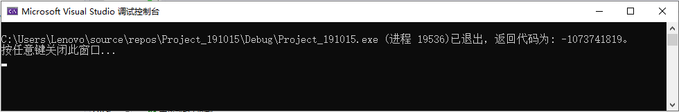  
* 项目生成后调试执行  
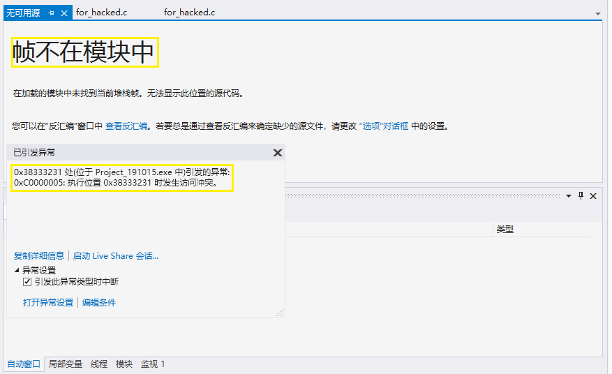  
经过查ASCII码表得知0x38333231代表的正是十进制的字符串“1238”，即代码中的ov字符串的1238处是其返回地址对应的位置。那么只要将hacked函数的地址填在该位置，就可以完成本次实验中针对栈溢出的攻击。  
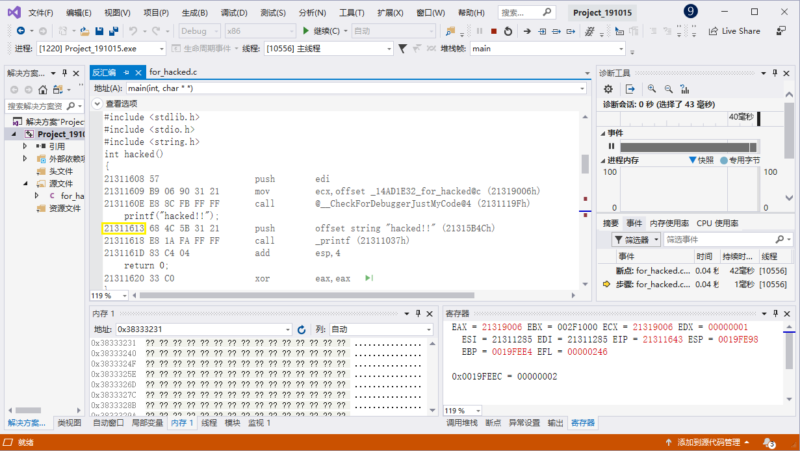
依图中地址对ov字符串的值进行修改：  
```bash
char* ov = "1234123512361237\x13\x16\x31\x21";
```
*注意：替换时将目标地址反向写入*  
* 运行结果  
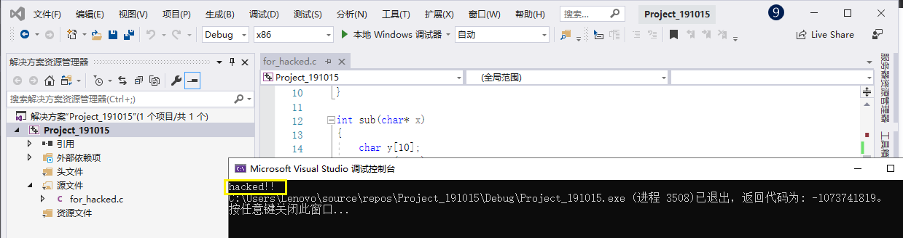  
hacked字符串成功输出，则实验part2成功。  