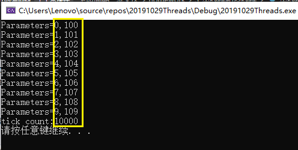
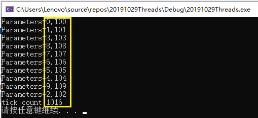

# 单线程与多线程
## 线程，进程，程序
在本学期的操作系统的学习中，我们对这三者的了解更深了一步，这里仅做概念解释。  
* 程序：往往对应着文件，为静态概念。 
* 进程：程序的执行态，为动态概念。一个正在运行的程序可以看做一个进程，进程拥有独立运行所需要的全部资源。  
* 线程：程序中独立运行的代码段。  
一个程序可能对应多个进程，一个进程由多个线程组成。  
* 单线程
  * 每个正在运行的程序（即进程），至少包括一个线程，即主线程。  
  * 主线程在程序启动时被创建，用于执行main函数。  
  * 只有一个主线程的程序，称作单线程程序。  
  * 主线程负责执行程序的所有代码。这些代码只能顺序执行，无法并发执行。  
* 多线程
  * 拥有多个线程的程序，称作多线程程序。  
  * 相对于主线程来讲，其他线程，称为子线程。  
  * 子线程和主线程都是独立的运行单元，各自的执行互不影响，因此能够并发执行。  
* 单线程、多线程的区别  
  * 单线程程序：只有一个线程，代码顺序执行，容易出现代码阻塞（页面假死）。  
  * 多线程程序：有多个线程，线程间独立运行，能有效地避免代码阻塞，并且提高程序的运行性能，但要占据更多的空间。  
## 实验准备
* 单线程
  * 代码 
```bash
  #include <windows.h>
  #include <tchar.h>
  #include <strsafe.h>
  #include <iostream>
  #define MAX_THREADS 10
  #define BUF_SIZE 255

  DWORD WINAPI MyThreadFunction(LPVOID lpParam);
  void ErrorHandler(LPTSTR lpszFunction);
  
  typedef struct MyData {
	  int val1;
	  int val2;
  } MYDATA, * PMYDATA;
  
  int _tmain()
  {
	  PMYDATA pDataArray[MAX_THREADS];
	  DWORD   dwThreadIdArray[MAX_THREADS];
	  HANDLE  hThreadArray[MAX_THREADS];
  
	  DWORD start = GetTickCount();
  
	  for (int i = 0; i < MAX_THREADS; i++)
	  {
		  pDataArray[i] = (PMYDATA)HeapAlloc(GetProcessHeap(), HEAP_ZERO_MEMORY,
			sizeof(MYDATA));
  
		  if (pDataArray[i] == NULL)
		  {
			  ExitProcess(2);
		  }
  
		  pDataArray[i]->val1 = i;
		  pDataArray[i]->val2 = i + 100;
		  MyThreadFunction(pDataArray[i]);
  
	  } // End of main thread creation loop.
	  DWORD end = GetTickCount();
	  printf("tick count:%d\n", end - start);
	  system("pause");
  }
  
  
  DWORD WINAPI MyThreadFunction(LPVOID lpParam)
  {
	  PMYDATA pDataArray;
	  pDataArray = (PMYDATA)lpParam;
	  Sleep(1000);
	  printf("Parameters=%d,%d\n", pDataArray->val1, pDataArray->val2);
	  return 0;
  }
  
  void ErrorHandler(LPTSTR lpszFunction)
  {
	  LPVOID lpMsgBuf;
	  LPVOID lpDisplayBuf;
	  DWORD dw = GetLastError();
  
	  FormatMessage(
	      FORMAT_MESSAGE_ALLOCATE_BUFFER |
	      FORMAT_MESSAGE_FROM_SYSTEM |
	      FORMAT_MESSAGE_IGNORE_INSERTS,
		  NULL,
		  dw,
		  MAKELANGID(LANG_NEUTRAL, SUBLANG_DEFAULT),
		  (LPTSTR)& lpMsgBuf,
		  0, NULL);
  
	  lpDisplayBuf = (LPVOID)LocalAlloc(LMEM_ZEROINIT,
		  (lstrlen((LPCTSTR)lpMsgBuf) + lstrlen((LPCTSTR)lpszFunction) + 40) * sizeof(TCHAR));
	  StringCchPrintf((LPTSTR)lpDisplayBuf,
		  LocalSize(lpDisplayBuf) / sizeof(TCHAR),
		  TEXT("%s failed with error %d: %s"),
		  lpszFunction, dw, lpMsgBuf);
	  MessageBox(NULL, (LPCTSTR)lpDisplayBuf, TEXT("Error"), MB_OK);
	  LocalFree(lpMsgBuf);
	  LocalFree(lpDisplayBuf);
  }
```
* HeapAlloc为Windows API函数，用于在指定的堆上分配内存（分配后的内存不可移动）。
* GetProcessHeap：获取和调用进程的堆句柄.
* ```pDataArray[i] = (PMYDATA)HeapAlloc(GetProcessHeap(), HEAP_ZERO_MEMORY,sizeof(MYDATA));```：在堆内存上申请了一个不可移动的空间，大小为```sizeof(MYDATA)```。

* 多线程
  * 代码  
```bash
#include <windows.h>
#include <tchar.h>
#include <strsafe.h>
#include <iostream>
#define MAX_THREADS 10
#define BUF_SIZE 255

DWORD WINAPI MyThreadFunction(LPVOID lpParam);
void ErrorHandler(LPTSTR lpszFunction);

// Sample custom data structure for threads to use.
// This is passed by void pointer so it can be any data type
// that can be passed using a single void pointer (LPVOID).
typedef struct MyData {
	int val1;
	int val2;
} MYDATA, * PMYDATA;

int _tmain()
{
	PMYDATA pDataArray[MAX_THREADS];
	DWORD   dwThreadIdArray[MAX_THREADS];
	HANDLE  hThreadArray[MAX_THREADS];
	DWORD start = GetTickCount();
	for (int i = 0; i < MAX_THREADS; i++)
	{
		pDataArray[i] = (PMYDATA)HeapAlloc(GetProcessHeap(), HEAP_ZERO_MEMORY, sizeof(MYDATA));
		if (pDataArray[i] == NULL)
			ExitProcess(2);
		pDataArray[i]->val1 = i;
		pDataArray[i]->val2 = i + 100;
		hThreadArray[i] = CreateThread(NULL, 0, MyThreadFunction, pDataArray[i], 0, &dwThreadIdArray[i]);
		if (hThreadArray[i] == NULL)
		{
			printf("CreateTread Error(%d)", GetLastError());
			ExitProcess(3);
		}
	}
	WaitForMultipleObjects(MAX_THREADS, hThreadArray, TRUE, INFINITE);
	DWORD end = GetTickCount();
	printf("tick count:%d\n", end - start);
	for (int i = 0; i < MAX_THREADS; i++)
	{
		CloseHandle(hThreadArray[i]);
		if (pDataArray[i] != NULL)
		{
			HeapFree(GetProcessHeap(), 0, pDataArray[i]);
			pDataArray[i] = NULL;
		}
	}
	system("pause");
}

DWORD WINAPI MyThreadFunction(LPVOID lpParam)
{
	PMYDATA pDataArray;
	pDataArray = (PMYDATA)lpParam;
	Sleep(1000);
	printf("Parameters=%d,%d\n", pDataArray->val1, pDataArray->val2);
	return 0;
}

void ErrorHandler(LPTSTR lpszFunction)
{
	// Retrieve the system error message for the last-error code.

	LPVOID lpMsgBuf;
	LPVOID lpDisplayBuf;
	DWORD dw = GetLastError();

	FormatMessage(
		FORMAT_MESSAGE_ALLOCATE_BUFFER |
		FORMAT_MESSAGE_FROM_SYSTEM |
		FORMAT_MESSAGE_IGNORE_INSERTS,
		NULL,
		dw,
		MAKELANGID(LANG_NEUTRAL, SUBLANG_DEFAULT),
		(LPTSTR)& lpMsgBuf,
		0, NULL);
	lpDisplayBuf = (LPVOID)LocalAlloc(LMEM_ZEROINIT,
		(lstrlen((LPCTSTR)lpMsgBuf) + lstrlen((LPCTSTR)lpszFunction) + 40) * sizeof(TCHAR));
	StringCchPrintf((LPTSTR)lpDisplayBuf,
		LocalSize(lpDisplayBuf) / sizeof(TCHAR),
		TEXT("%s failed with error %d: %s"),
		lpszFunction, dw, lpMsgBuf);
	MessageBox(NULL, (LPCTSTR)lpDisplayBuf, TEXT("Error"), MB_OK);
	LocalFree(lpMsgBuf);
	LocalFree(lpDisplayBuf);
}
```
* CreateThread ：创建一个新线程。
* lpThreadAttributes ：默认安全属性时传入NULL。
* dwStackSize ：指定线程初始时的栈大小，通常传入0即可，此时系统会使用一个合适的大小
* lpStartAddress ：新线程入口函数的地址。
* lpParameter ：传入线程入口的参数，这个参数完全由调用者使用，系统只是简单的将这个参数传递给线程函数，不做别的任何处理。
* dwCreationFlags ：指出创建线程的方式，如果是0，表示线程一被创建就被立即执行。
* lpThreadId ：得到线程唯一的标识符。
* WaitForMultipleObjects ：等待所有线程终止。  
## 实验结果
### 单线程
10个线程按顺序创建，按顺序调度。  
  
### 多线程
10个线程按顺序创建的，但线程的调度随机。  
  