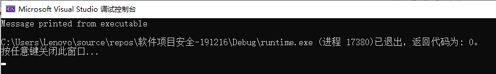

# 20191216实验报告

## 1 进程查看

使用从[微软网页](https://docs.microsoft.com/zh-cn/windows/win32/toolhelp/taking-a-snapshot-and-viewing-processes)上拷贝的代码，进行部分修改后，用以查看当前电脑中运行的进程，同时开命令行使用tasklist命令查看进程，可以在两边的命令行结果中看到：均显示了当前正在运行中的进程及其进程ID。
  

## 2 静态链接

* 链接：把若干个程序的组成部分拼接在一起。  
* 静态链接是由链接器在链接时将库的内容加入到可执行程序中的做法。  
静态链接和动态链接两者最大的区别就在于链接的时机不一样，静态链接是在形成可执行程序前，而动态链接的进行则是在程序执行时。  
* 实际开发中，不可能将所有代码放在一个源文件中，所以会出现多个源文件，而且多个源文件之间不是独立的，而会存在多种依赖关系，如一个源文件可能要调用另一个源文件中定义的函数，但是每个源文件都是独立编译的，即每个*.c文件会形成一个*.o文件，为了满足前面说的依赖关系，则需要将这些源文件产生的目标文件进行链接，从而形成一个可以执行的程序。这个链接的过程就是静态链接。  

新建项目vm，在其中新建两个源文件：a.c和b.c。代码如下：  
**a.c：**

    int sub();  
    int main()  
    {  
	    sub();  
    }  

**b.c：**  

    #include<Windows.h>  
    int sub()  
    {  
	    MessageBox(0, "LIDONGHAI", 0, 0);  
	    return 0;  
    }  

在上述的两个文件中，可看出：sub()函数被定义在b.c中，但在a.c中却声明了sub()函数，并调用了该函数。即前述提到的并非所有代码都放在一个源文件中，而是有多个源文件的情况。  
**Visual Studio命令提示中的手动编译链接过程及结果：**   
使用```cl.exe /c *.c```语句对a.c进行编译（/c：仅编译不链接）  
再输入命令```link a.obj b.obj User32.lib /out:haha.exe```将生成的两个obj文件链接成一个exe文件（*因为使用了User32.lib中的MseeageBoxA函数，因此需要在手动链接时加上User32.lib，若此种写法不成功的需要写完整User32.lib的路径，但在使用VS进行项目执行时，因为vs中预先设置中已有许多常用库，故不需要格外写出*）。可以成功链接，并且生成的exe文件可以正确执行。若仅使用两个obj文件中的任一个进行链接过程，均会报错：  
  
由两个源文件的代码可以看出，a.c中虽然定义了主函数（即b.c缺少的函数入口点），但是对于其本身调用的sub()函数并没有定义。b.c中则正相反。   
使用visual studio的工具Visual Studio命令提示，输入以下命令：```dumpbin /imports haha.exe```查看生成的exe中的导入库，结果如下：  
  
从上图中可看出Imports内容中没有sub()函数因为sub()函数本身就在exe内部，而messagebox不在内部。  
同样，对User32.dll的exports部分使用命令```dumpbin /exports User32.dll >C:\Users\Lenovo\Desktop\result.txt```进行查看，也可在result.txt中看到被haha.exe调用的MessageBoxA函数。  
  
**Visual Studio编译链接过程及结果：**   
若使用vs的项目生成和非调试执行进行编译链接过程以及结果显示，则会报错。  
  


## 3 编写dll文件

新创建空项目baselib，新建源文件base.c和base.def文件，*.c文件中有将生成的库中的函数，仅是函数，不需要主函数，而在*.def文件中设定了生成的库文件的名称（LIBRARY name）和将导出函数表（EXPORTS function1,function2)  
**base.c：**

```bash
    #include<Windows.h>
    //本文件中不需要main函数，main函数在exe中
    int internal_function()
    {
	    return 0;
    }

    int lib_function(char* msg)
    {
	    //do some works
	    MessageBoxA(0, 
		    "MSG from base lib",
		    msg,
		    MB_OK);
	    return 0;
    }
```
**exp.def：**
```bash
    LIBRARY base      //生成的lib文件的名称
    EXPORTS           //导出函数表
	    lib_function
```

**Visual Studio命令提示中的手动编译链接过程及结果：**   
同样使用前述vs命令行输入```cl.exe /c base.c```对base.c进行仅编译不链接，在链接一步时，命令发生了改变：```link base.obj User32.lib /dll /def:exp.def /out:base.dll```，可以看出使用了def文件，而且生成的对象类型也并非常见的exe，而是dll。命令中也可以将多个obj文件链接生成一个dll文件，只需稍作修改。  
再使用```dumpbin /exports base.dll```命令查看base.dll的导出表，可以找到之前提到的、在EXPORTS后的函数lib_function()：  
  
**Visual Studio编译链接过程及结果：**   
如果使用vs完成上述过程，需修改*项目属性->常规->配置类型*和*项目属性->链接器->输入->模块定义文件*：  
  
 

## 4 load time 动态链接——在其他项目中调用自主编写的库中函数

新建空项目app，新建app.c、baselib.h（头文件建在之前的base项目下）,此外还需将base.lib和base.dll拷贝一份放在app文件下。  
**app.c：**  

    #include "..\baselib\baselib.h"   //此处采用的是头文件的相对地址写法
    int main()
    {
	    lib_function("call a dll~LDH");
    }

**baselib.h：**  

    #pragma once      //.h文件格式(自带)
    int lib_function(char* msg);//导出函数声明

**Visual Studio命令提示中的手动编译链接过程及结果：**   
先输入命令```cl.exe /c app.c```对app.c文件进行仅编译，再用```link app.obj ..\base\base.lib /out:app.exe```利用上一步生成的app.obj进行app.exe的生成。  
使用```dumpbin /imports app.exe```命令查看app.exe的引入库：  
  
**Visual Studio编译链接过程及结果：**   
直接项目执行会报错：无法得知如何查找lib文件。  
  
修改方法：  
添加头文件base.lib 将函数声明放入其中  
编译环境中设置环境变量即可使用  
或者放入项目属性c/c++包含目录中  

## 5 run time 动态链接
将某些目标模块的链接，推迟到执行时才进行。即在执行过程中，若发现一个被调用模块尚未装入内存时，才由OS去找到该模块，将它装入内存，并把它连接到调用者模块上。  
* 使用LoadLibrary函数获取指定DLL的句柄。如果获取成功，则程序将使用GetProcAddress函数中返回的句柄来获取DLL的某一指定函数的地址。调用DLL函数后，程序将调用FreeLibrary函数以卸载DLL。
* 当应用程序调用LoadLibrary函数时，系统会尝试定位DLL（方式和载入时动态链接的定位过程一致：①应用程序载入目录 ②当前目录 ③系统目录 等）。如果找到，系统就把DLL模块映射到进程的虚地址空间中，并增加引用计数。
* 如果调用LoadLibrary时指定的DLL其代码已经映射到调用进程的虚地址空间，函数就会仅返回DLL的句柄并增加DLL引用计数。
* 如果DLL不可用，运行时动态链接可以响应该错误。
* 当dll不可用时，并非为Load-Time链接时的弹框终止运行，而会直接报错。 
#### 代码1
```bash
// A simple program that uses LoadLibrary and 
// GetProcAddress to access myPuts from Myputs.dll. 

#include <windows.h> 
#include <stdio.h> 

typedef int(__cdecl* MYPROC)(LPWSTR);

int main(void)
{
	HINSTANCE hinstLib;
	MYPROC ProcAdd;
	BOOL fFreeResult, fRunTimeLinkSuccess = FALSE;

	// Get a handle to the DLL module.

	hinstLib = LoadLibrary(TEXT("MyPuts.dll"));

	// If the handle is valid, try to get the function address.

	if (hinstLib != NULL)
	{
		ProcAdd = (MYPROC)GetProcAddress(hinstLib, "myPuts");

		// If the function address is valid, call the function.

		if (NULL != ProcAdd)
		{
			fRunTimeLinkSuccess = TRUE;
			(ProcAdd)(L"Message sent to the DLL function\n");
		}
		// Free the DLL module.

		fFreeResult = FreeLibrary(hinstLib);
	}

	// If unable to call the DLL function, use an alternative.
	if (!fRunTimeLinkSuccess)
		printf("Message printed from executable\n");

	return 0;
}
```
运行结果：  
  
#### 代码2  
```bash
// A simple program that uses LoadLibrary and 
// GetProcAddress to access myPuts from Myputs.dll. 

#include <windows.h> 
#include <stdio.h> 
typedef int(__cdecl* MYPROC)(LPWSTR);
int main(void)
{
	HINSTANCE hinstLib;
	MYPROC ProcAdd;
	BOOL fFreeResult, fRunTimeLinkSuccess = FALSE;

	// Get a handle to the DLL module.
	hinstLib = LoadLibrary(TEXT("User32.dll"));

	// If the handle is valid, try to get the function address.
	if (hinstLib != NULL)
	{
		ProcAdd = (MYPROC)GetProcAddress(hinstLib, "MessageBoxA");
		// If the function address is valid, call the function.
		if (NULL != ProcAdd)
		{
			fRunTimeLinkSuccess = TRUE;
			(ProcAdd)(0, "msg", 0, 0);
		}
		// Free the DLL module.
		fFreeResult = FreeLibrary(hinstLib);
	}

	// If unable to call the DLL function, use an alternative.
	if (!fRunTimeLinkSuccess)
		printf("Message printed from executable\n");
	return 0;
}
```
**修改：**  
LoadLibrary参数、GetProcAddress参数;传入MessageBoxA函数的参数设为(0, "msg", 0, 0);程序会自己在系统目录找到User32.dll。  
**运行结果：**  
  
和直接调用MessageBoxA(0, "msg", 0, 0)结果一致。  
#### 代码3  
```bash
// A simple program that uses LoadLibrary and 
// GetProcAddress to access myPuts from Myputs.dll. 

#include <windows.h>
#include <stdio.h>
typedef int(__cdecl* MYPROC)(LPWSTR);
int main(void)
{
	HINSTANCE hinstLib;
	MYPROC ProcAdd;
	BOOL fFreeResult, fRunTimeLinkSuccess = FALSE;

	// Get a handle to the DLL module.
	hinstLib = LoadLibrary(TEXT("base.dll"));

	// If the handle is valid, try to get the function address.
	if (hinstLib != NULL)
	{
		ProcAdd = (MYPROC)GetProcAddress(hinstLib, "lib_function");
		// If the function address is valid, call the function.
		if (NULL != ProcAdd)
		{
			fRunTimeLinkSuccess = TRUE;
			(ProcAdd)(0, "helloworld_LJ", 0, 0);
		}
		// Free the DLL module.
		fFreeResult = FreeLibrary(hinstLib);
	}

	// If unable to call the DLL function, use an alternative.
	if (!fRunTimeLinkSuccess)
		printf("Message printed from executable\n");
	return 0;
}
```
**修改：**  
再次修改了LoadLibrary参数和GetProcAddress参数；传入lib_function函数的参数改为("helloworld_LJ")（仅一个参数）；把base.dll拷贝到当前目录下。  

**运行结果：**  
   
和直接调用lib_function("helloworld_LJ")是一致的。  
run-time动态链接成功。  