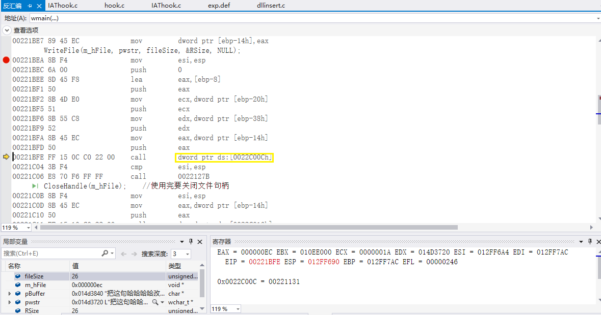
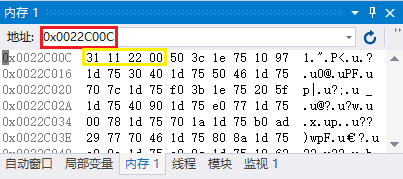
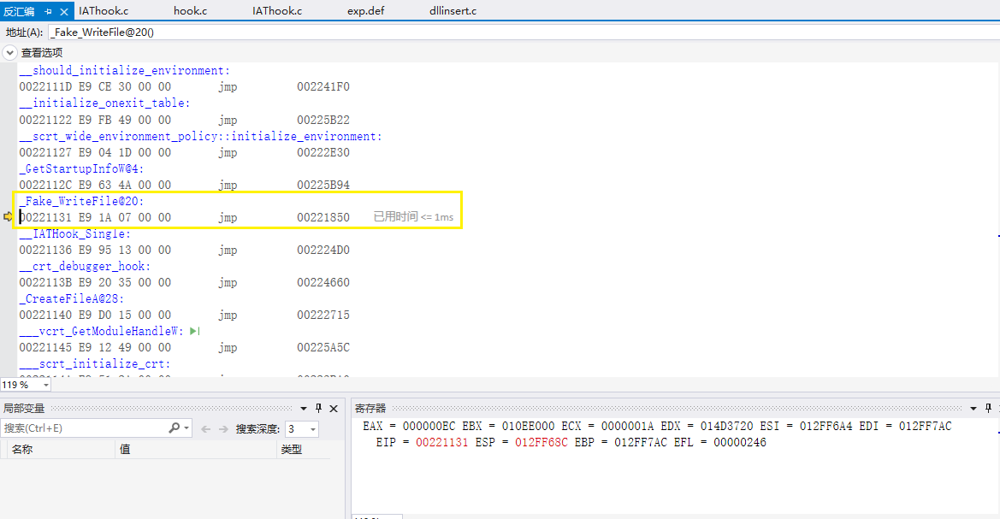
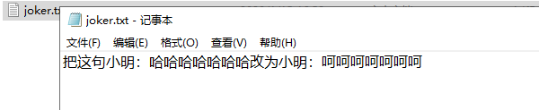
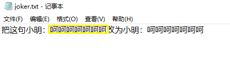

# API hook & DLL insert(以notepad.exe为例)
## API hook
Hook是Windows中提供的一种用以替换DOS下“中断”的系统机制，中文译为“挂钩”或“钩子”。在对特定的系统事件进行hook后，一旦发生已hook事件，对该事件进行hook的程序就会受到系统的通知，这时程序就能在第一时间对该事件做出响应。  
 HOOK API的思路就是修改原API的入口,使其跳转到我们的假API入口, 然后执行假API函数。  
## 实验过程
#### 用IAT hook技术替换WriteFile()函数  
使用IAT hook技术将txt文件中的所有“哈”替换成“呵”。  
**思路：**  
找到导入表中kernel32.dll的WriteFile函数对应的位置，将调用处的地址用自己编写的Fake_WriteFile函数地址替换。当程序调用kernel32.dll中的WriteFile函数时，由于地址被替换而其实调用的是Fake_WriteFile。（和之前的hacked函数那个同思路）  
**修改结果：**  
在完成修改之后，对dll项目进行生成文件为exe（即此时的项目属性中未改生成文件类型）情况下的调试，为了观察调用Fake_WriteFile函数是否成功。  
  
在上图中，WriteFile函数的反汇编指令中的call指令指向一个地址。对这个地址存储内容进行查看（由之前实验中栈帧的构造可知，call指令在前往被调函数的同时，将创造一个新的栈结构，同时将当前地址存入作为返回地址，存为新栈的栈底：  
  
0x0022C00C地址中存储了Fake_WriteFile函数的起始地址：  
  
可见“以假乱真”成功。  
#### 将IAT hook部分生成为dll文件
项目属性修改同之前的dll实验，此处不再赘述。  
#### 攻击notepad.exe
此处的dll注入过程和之前单独的dll注入实验同原理，在本次实验中为实验的一个环节。  
**目标：**  
  
注意在DLLinsert项目执行时需要保持joker.txt的打开状态，否则运行结果将为无输出（无修改）。运行时，将调用来自dll文件中的导出函数wmain（在DLL_PROCESS_ATTACH时），进而调用之前的Fake_WriteFile函数。  
**修改结果：**  
  
修改成功。